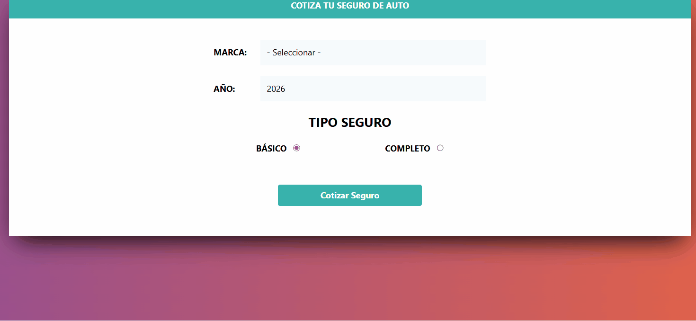

# 🛡️ Cotizador de Seguros de Auto - JS Prototypes

## 📽️ Demostración del Funcionamiento

| 📝 Validación y Cálculo | ⏳ Simulación de Carga |
| :---: | :---: |
|  |  |

> **Nota:** El proyecto utiliza una **arquitectura basada en Prototipos**, optimizando el uso de memoria al compartir métodos entre instancias de la clase `UI` y `Seguro`.

**[🔗 Ver Demo en Vivo](https://tu-usuario.github.io/cotizador-seguros-prototypes/)**


Este simulador permite obtener el costo de una póliza de seguro en tiempo real, basándose en la marca del vehículo, el año de fabricación y el tipo de cobertura, aplicando algoritmos de depreciación anual.

## 🚀 Funcionalidades
- **Cálculo Dinámico:** Algoritmo que incrementa el costo por marca (Americano 15%, Asiático 5%, Europeo 35%).
- **Depreciación Automática:** Reducción del 3% del valor por cada año de antigüedad del vehículo.
- **Interfaz Reactiva:** Validación de campos obligatorios con alertas dinámicas.
- **UX Optimizada:** Implementación de un Spinner de carga para simular el procesamiento de datos asíncrono.

## 🛠️ Conceptos Técnicos Aplicados
- **JavaScript Prototypes:** Implementación de métodos en el prototipo para evitar la duplicidad de funciones en memoria.
- **Instanciación de Clases:** Uso de funciones constructoras para generar objetos de tipo `Seguro` y `UI`.
- **Manipulación del DOM:** Inserción dinámica de elementos y gestión de temporizadores con `setTimeout`.
- **Tailwind CSS:** Maquetado moderno y responsivo mediante utilidades de CSS de bajo nivel.

## 💡 Aprendizajes Clave
Este proyecto fue crucial para entender cómo JavaScript maneja la **herencia y los prototipos** internamente. A diferencia de las clases modernas, trabajar con `.prototype` permite comprender el "bajo nivel" del lenguaje, una base indispensable antes de avanzar hacia **React** y el desarrollo de componentes escalables.

## 🔧 Instalación y Uso

1. Clona el repositorio:
```bash
git clone https://github.com/PabloRamirezCasas/cotizador-seguros-prototypes.git